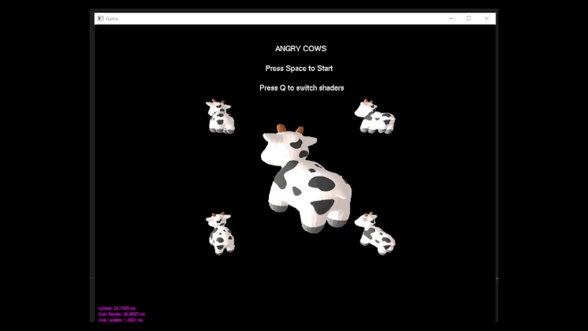

# 3D Game Engine (Bitblitzer)

This project was originally written as a submission for the Ubisoft NEXT competition where participants are challenged to create a game in under a weekend. This repository host the game engine that a was crafted over the course of 2 or 3 months in preperation for the event. This repo also feature the implemented game.

## Angry Cows

The Game Implemented is called Angry Cows it is a parody of angry birds but Multiplayer!

Two sides setup their own base and attempt to kill each others cows you can see the gameplay video [here](https://youtu.be/BuU8Q-LBqdk)

## Compilation

This project was written using Visual Studio 2022. The processor must support AVX2 instruction to run this project.
Please compile this project under release mode or the game will be unplayable laggy.

## Features

The Engine features

- A novel tiled multithreaded cpu based rasterizer using SIMD instruction graphics acceleration
- 2D physics handling
- Entity Component System to exploit the cache locality
- Math library featuring (Vector, Quaternion, Matrix)

## Documentation

Documentation for this repository is written [here](./Documentation.pdf)